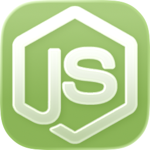

# NPMExplorer



NPM package explorer applet for searching npm registry.  
Native macOS UI built with [ActionUI](https://github.com/abra-code/ActionUI)

## Development Setup

This project depends on the local `ActionUI` module. Before running, install local dependencies:

```bash
npm install
```

This symlinks `actionui` from `../ActionUI/ActionUINodeJS` into `node_modules`.
